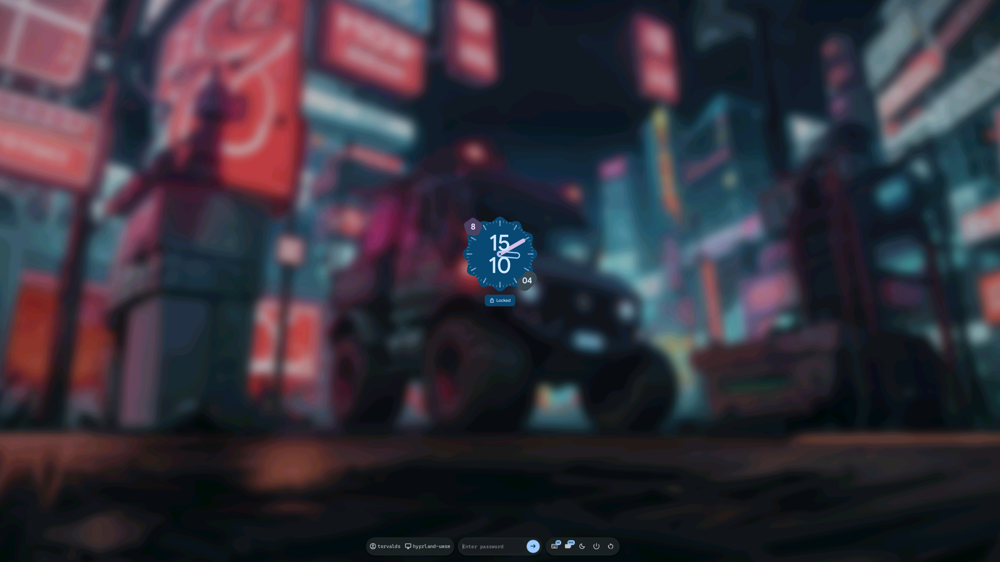

# ii-material-sddm

[](https://github.com/ToRvaLDz/ii-material-sddm/releases/latest)
[](LICENSE)
[](https://github.com/sddm/sddm)
[](https://www.qt.io/)
[](https://m3.material.io/)
[](https://aur.archlinux.org/packages/ii-material-sddm-git)
[](https://store.kde.org/browse?cat=101)
[](packaging/nix/package.nix)
[](https://github.com/ToRvaLDz/ii-material-sddm/stargazers)

<p align="center">
  <a href="https://buymeacoffee.com/marcomigozzi"></a>
</p>

An SDDM login theme built with **Material Design 3**, inspired by the `ii` lockscreen from [end-4/dots-hyprland](https://github.com/end-4/dots-hyprland) — a set of usability-first Hyprland dotfiles.



---

## Features

- Material Design 3 color system with full customization via `colors.json`
- Analog clock with large display
- Blurred wallpaper background with configurable overlay
- Bottom toolbar with session selector, user selector and system actions
- Virtual keyboard support
- Multi-language support via `translations.js`
- Qt6 / SDDM 0.21+

---

## Dependencies

- `sddm` ≥ 0.21
- `qt6-declarative`
- `qt6-5compat` (for blur effects)
- `acl` (for matugen integration)
- Font: **Google Sans Flex** (optional, falls back to system font)

---

## Installation

### Script (recommended)

```bash
git clone https://github.com/ToRvaLDz/ii-material-sddm
cd ii-material-sddm
sudo ./install.sh
```

The script installs the theme, enables it in SDDM, and configures ACL permissions for matugen integration.

### Arch Linux (AUR)

```bash
yay -S ii-material-sddm-git
```

### Debian / Ubuntu

```bash
git clone https://github.com/ToRvaLDz/ii-material-sddm
cd ii-material-sddm
sudo apt install debhelper sddm
dpkg-buildpackage -us -uc -b
sudo dpkg -i ../ii-material-sddm_*.deb
```

### Fedora / RHEL

```bash
git clone https://github.com/ToRvaLDz/ii-material-sddm
rpmbuild -ba packaging/fedora/ii-material-sddm.spec \
  --define "_sourcedir $(pwd)"
sudo dnf install ~/rpmbuild/RPMS/noarch/ii-material-sddm-*.rpm
```

### NixOS

Add to your configuration:

```nix
environment.systemPackages = [
  (pkgs.callPackage (fetchurl {
    url = "https://raw.githubusercontent.com/ToRvaLDz/ii-material-sddm/main/packaging/nix/package.nix";
  }) {})
];
```

Or with flakes:

```nix
inputs.ii-material-sddm.url = "github:ToRvaLDz/ii-material-sddm";
```

### KDE Plasma (Get New Themes)

Open **System Settings → Startup and Shutdown → Login Screen (SDDM) → Get New Themes** and search for `ii-material-sddm`.

Alternatively, download the tarball from the [KDE Store](https://store.kde.org/browse?cat=101) and install it via the same dialog.

### Manual

```bash
git clone https://github.com/ToRvaLDz/ii-material-sddm
sudo cp -r ii-material-sddm /usr/share/sddm/themes/
```

Then configure SDDM in `/etc/sddm.conf.d/theme.conf`:

```ini
[General]
GreeterEnvironment=QML_XHR_ALLOW_FILE_READ=1

[Theme]
Current=ii-material-sddm
```

> `QML_XHR_ALLOW_FILE_READ=1` is required for the theme to load colors and wallpaper from disk.

---

## Configuration

Edit `theme.conf` to customize the theme:

```ini
[General]
Background=Backgrounds/default.jpg
ColorsFile=colors.json
BlurRadius=100
BlurEnabled=true
BlurExtraZoom=1.1
BlurOverlayOpacity=0.3
ClockFontFamily=Google Sans Flex
ClockFontSize=90
ClockFontWeight=350
FontFamily=Google Sans Flex Medium
FontSize=15
```

### Matugen integration (automatic colors + wallpaper)

The theme natively integrates with [matugen](https://github.com/InioX/matugen). After running `install.sh`, colors and wallpaper update automatically every time you run matugen — no extra steps needed.

By default the theme reads from:

| File | Description |
|------|-------------|
| `~/.local/state/quickshell/user/generated/colors.json` | Material You color palette |
| `~/.local/state/quickshell/user/generated/wallpaper/path.txt` | Path to the active wallpaper |

These match the default output paths used by [end-4/dots-hyprland](https://github.com/end-4/dots-hyprland). If your matugen setup writes to different paths, override them in `theme.conf`:

```ini
WallpaperPathFile=/path/to/wallpaper/path.txt
```

The `colors.json` path can be overridden via the `ColorsFile` key.

The install script uses `setfacl` to grant the `sddm` user read access to those files without changing the permissions of your home directory.

---

## Credits

- Lockscreen design inspired by the `ii` theme from [end-4/dots-hyprland](https://github.com/end-4/dots-hyprland)

---

## License

[GPL-3.0](LICENSE)
